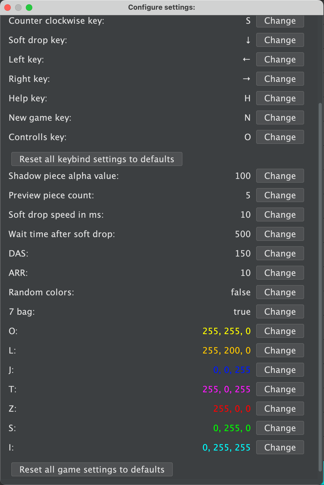

# Tetris

A modern Tetris clone built with Java and Swing. It features a highly customizable gameplay experience with persistent settings.
To play use [GameLauncher](https://github.com/wolftxt/GameLauncher).

_Gameplay showcasing the preview pieces and the shadow piece._

_The extensive settings menu._

---

## Features

* **Super Rotation System (SRS):** Standard Tetris Guideline rotation.
* **Persistent & Configurable Settings:** All settings are saved automatically and can be reset to defaults from the menu.
* **Customizable Controls:** Rebind any key for gameplay.
* **Adjustable Timings:**
    * **DAS (Delayed Auto Shift):** The delay before a piece starts moving automatically when a key is held.
    * **ARR (Auto Repeat Rate):** The speed at which a piece moves once DAS is initiated.
    * **Soft Drop Speed:** Controls the speed of soft dropping.
    * **Lock Delay:** The game waits up to 10x `WAIT_TIME_AFTER_SOFT_DROP` before locking a piece in place, allowing for last-second adjustments.
* **Visual Customization:**
    * **Shadow Piece:** Adjust the transparency (alpha value) of the shadow piece.
    * **Preview Count:** Change the number of upcoming pieces shown.
    * **Piece Colors:** Choose between randomized colors for each new piece or set a specific default color for each tetromino type.
* **Piece Generation:**
    * **7-Bag:** Guarantees that all seven unique tetrominoes appear in a random order within every set of seven pieces.
    * **Completely Random:** A purely random piece generator.

---

## How to Play

### Prerequisites

* **JDK 21** or later must be installed.

### Launching the Game

This game is designed to be played using the [GameLauncher](https://github.com/wolftxt/GameLauncher). Simply click download and play.

### Default Controls

* **H:** Open the help menu.
* **N:** Start a new game.
* **O:** Open the settings menu to modify keybinds and game options.

---

## Technologies Used

* **Java 21**
* **Java Swing** for the GUI
* **Maven** for dependency management
